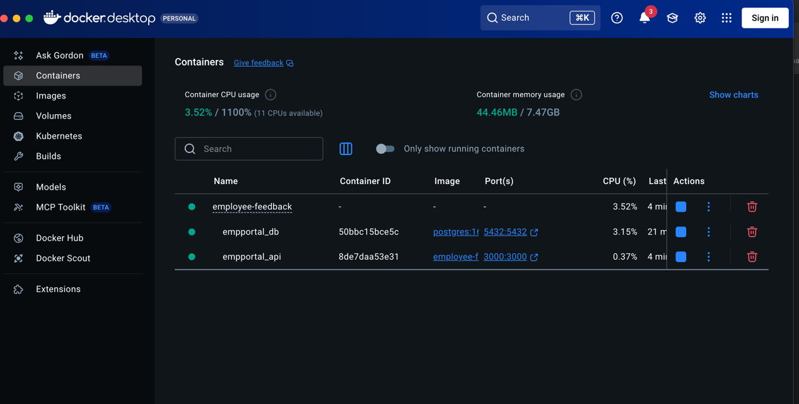
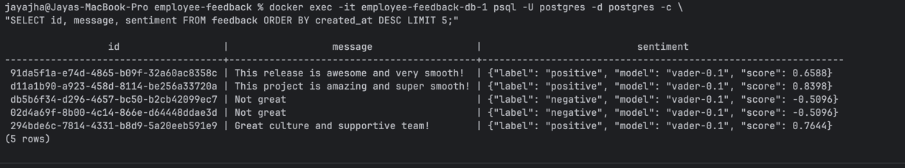
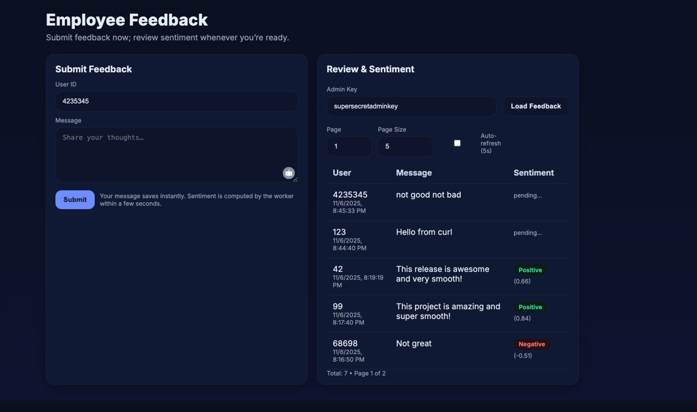

# 🧑‍💼 Employee Feedback App

A lightweight full-stack demo application that lets employees submit feedback and allows admins to view it in a simple dashboard.  
Built with **Node.js (Express)**, **PostgreSQL**, and **Docker Compose** — ideal for learning how to integrate backend services, APIs, and containerization.

---

## 🚀 Features

- 🗣️ Submit feedback with user ID and message
- 🔐 Simple admin endpoint to view feedback (with API key)
- 🧾 Pagination for viewing large feedback lists
- 🧱 Fully containerized with Docker Compose (API + DB)
- 🧩 Input validation using Zod
- 🌐 Minimal built-in UI served by Express (HTML + JS)
- 🏗️ Database schema auto-created at startup

---

## 🏗️ Tech Stack

| Layer | Technology |
|-------|-------------|
| Backend | Node.js, Express |
| Database | PostgreSQL |
| Validation | Zod |
| Containerization | Docker, Docker Compose |
| Logging & Security | Morgan, Helmet |
| UI | Static HTML (served by Express) |

---

## 📂 Project Structure

